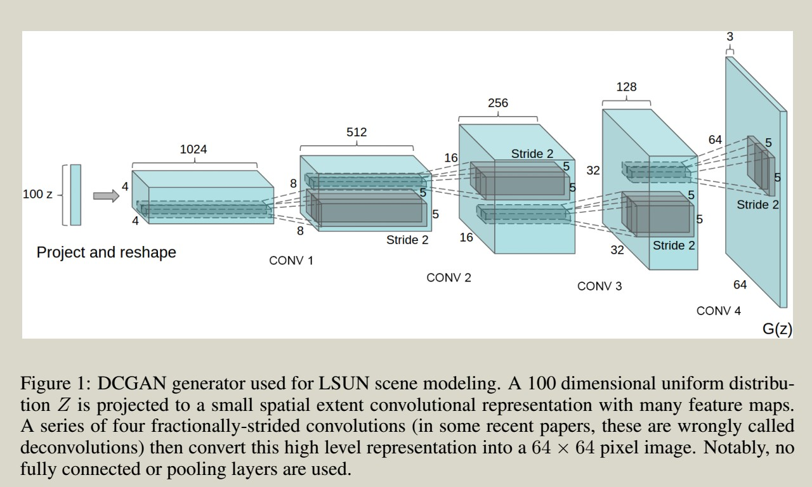
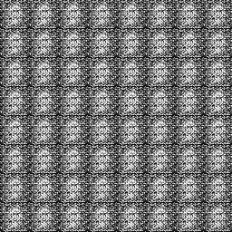
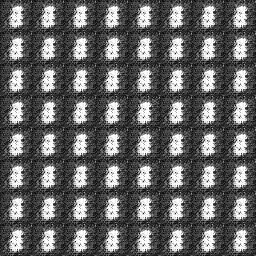
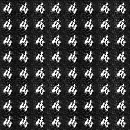
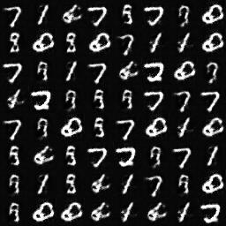
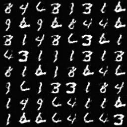
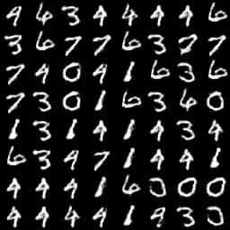

# DCGAN

DCGAN  is short for [Deep Convolutional Generative Adversarial Networks](https://arxiv.org/abs/1511.06434).  This is my tensorflow implementation from the DCGAN network structure in the paper. The data used here is MNIST dataset. 

## DCGAN network

DCGAN employs a generator network (G) which generates images from vectors in a 100 dimensional space. The structure of generator is demonstrated below (from original paper). Another part of the DCGAN is called a discriminator network (D). Discriminator network is a binary classifier (true or false). Given an image (from generated images or the real dataset), the discriminator checks if the image is a real image or generated from a 100 vector. 

Generator and discriminator network are trained simultaneously. During the training, the generator has been trained to produce images analog to the real images. The discriminator is trained to separate the generated and the real images.

## Results 

Images generated by the generator during the training process. At the beginning of training, the generated images are noise-like images. During the training, the generators become strong to produce images like the real ones.

